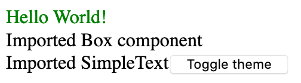
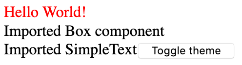
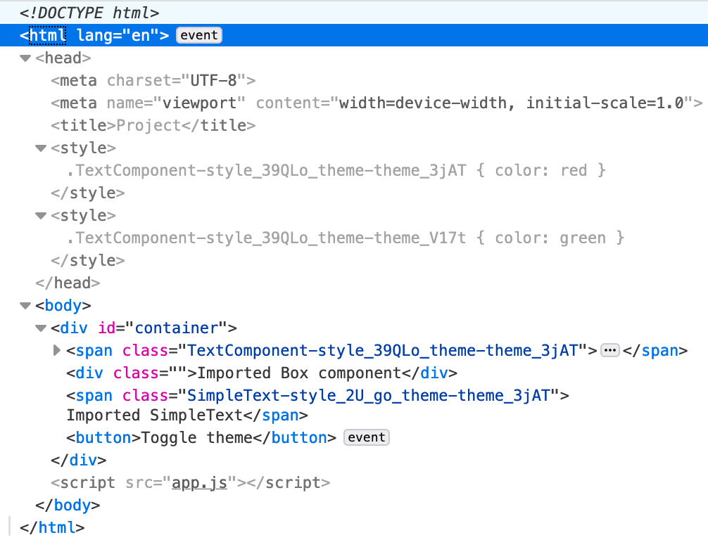

# Test case for `treat` themes in a shared component library

## Problem

When running `TheProject`, I noticed that the theme styles are not applied to the external compoenents. They are only applied to the internal ones.

green | red
--- | ---
 | 

The injected styles only show the theme classes that come from the project's `TextComponent`:

I'm wondering why they are not included. Is there something wrong with how I'm bundling `TheComponents`?

## Overview

### TheComponents
Several React components that are built with TypeScript and that use `treat` for styling. `Box` is a simpler version of [Braid's Box component](https://github.com/seek-oss/braid-design-system/blob/master/lib/components/Box/Box.tsx). and `SimpleText` is a just renders text in the current theme's `primary` color.

Both components should act as basic building blocks in a a shared component library. Therefore the project has its own `package.json` and it defines `react` and `react-treat` as `peerDependencies`. `treat` is defined as a `devDepenendency`.

The webpack build is a minimum TypeScript setup. The only noteworthy things about it are that it uses `treat/webpack-plugin` with the standard `style-loader`.

`npm i && npm run build` in that folder will build the components for you.

### TheProject
The project that uses the components from above. It's a simple `webpack-dev-server`-project that also uses uses the `treat/webpack-plugin` with the standard `style-loader`.

This project provides the actual theme file in `src/components/theme.treat.ts`.

It has a `TextComponent.tsx` that uses `useStyle` to the the `primary` color.

In `App.tsx` it renders the external `Box` and `SimpleText` component and it's own `TextComponent`. Two themes (`greenTheme`, `redTheme`) are provided with a `TreatProvider`. A button is rendered, that toggles between the two themes.

`npm i && npm run dev` will run the project locally at http://localhost:9000/.

../../../../../../../Users/janmonschke/Coding/treat-experiments/TheProject/node_modules/thecomponent/dist/TheComponent
../../../../../../../Users/janmonschke/Coding/treat-experiments/TheProject/node_modules/thecomponent/dist/TheComponent
